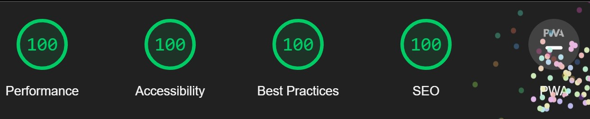

# blog


[](https://dependabot.com/)

This repository is my blog site made from [Next.js](https://nextjs.org/) and [microCMS](https://microcms.io/). And application is hosting from [Vercel](https://vercel.com/docs).

So, I mean I operate serverless basically.

At first, please access the [**フナイログ**](https://www.funailog.com/).

## Technical staffs ([JamStack](https://jamstack.org/))

- [Next.js](https://nextjs.org/) (React framework)
- [Vercel](https://vercel.com/docs) (PaaS)
- [microCMS](https://microcms.io/) (Headless CMS)
- [Mantine](https://mantine.dev/) (React components library)
- [Tailwind CSS](https://tailwindcss.com/) (CSS framework)

## Development

### Preparation

```bash
git clone https://github.com/paveg/blog
cd blog

npm install -g yarn
yarn install
```

### Environment

```bash
cp .env.sample .env
# please, fill in `.env`
```

### Run server

```bash
yarn run dev
# or
npx vercel dev
```

## Markdown

This mdx blog is supported as follows notation:

# H1

## H2

### H3

#### H4

##### H5

###### H6

**Bold text**

_Italic text_

**_Bold and italic text_**

~~Strike text~~

[Some Link](https://www.google.com/)

```tsx
import React, { FC } from 'react';

type Props = {
  name: 'sample';
};

const SampleComponent: FC<Props> = ({ name }: Props) => {
  return (
    <>
      <title>{name}</title>
    </>
  );
};
```

:::notice{.success}
Success message
:::

:::notice{.warning title='abc'}
Warning message
:::

:::notice{.error}
Error message
:::

**YouTube** iframe

:::youtube[Four by four.]{#id}
:::

**GoogleMap** iframe

:::googlemap{.googlemap src='url'}
:::

**details** information

:::details{summary='description'}
Note
:::

{本気}^(マジ)、{有難}^(アザ)っス…

## Lighthouse CI



## License

Copyright © 2022 Ryota Ikezawa ([@paveg](https://twitter.com/paveg_))

The source code is licensed [MIT](https://github.com/paveg/blog/blob/main/LICENSE).
